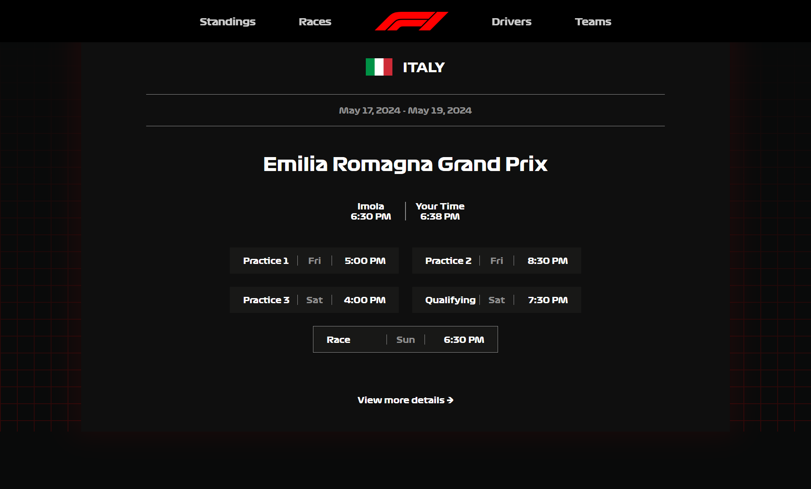
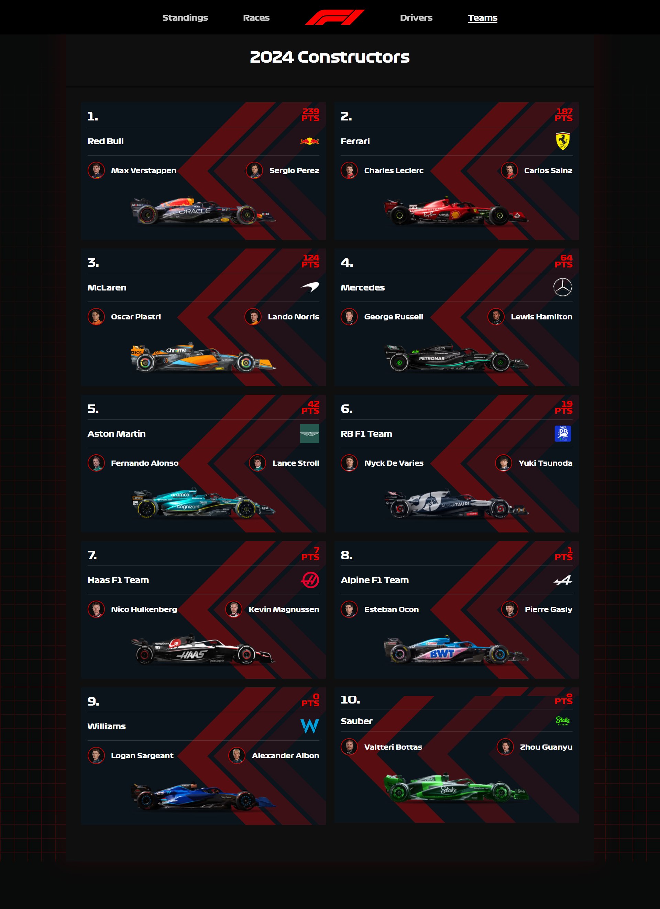
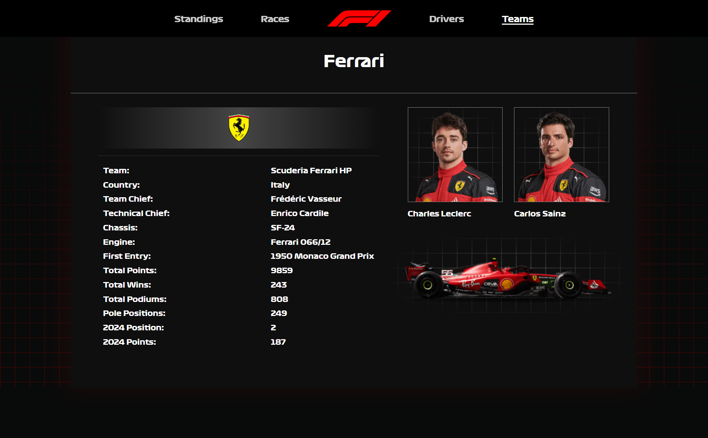
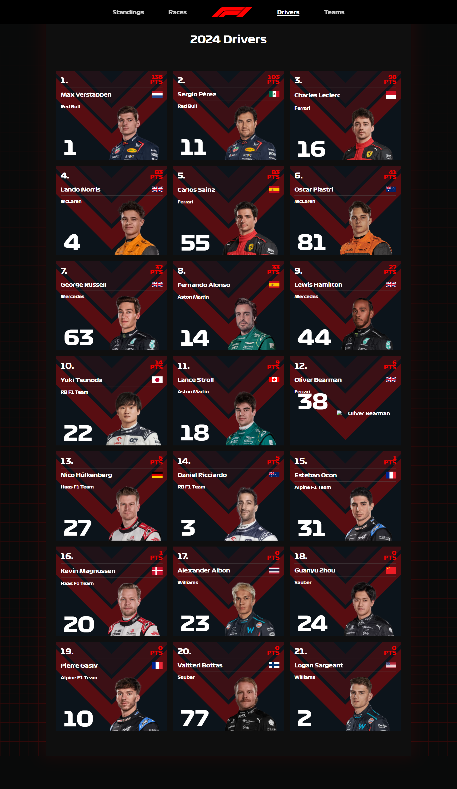
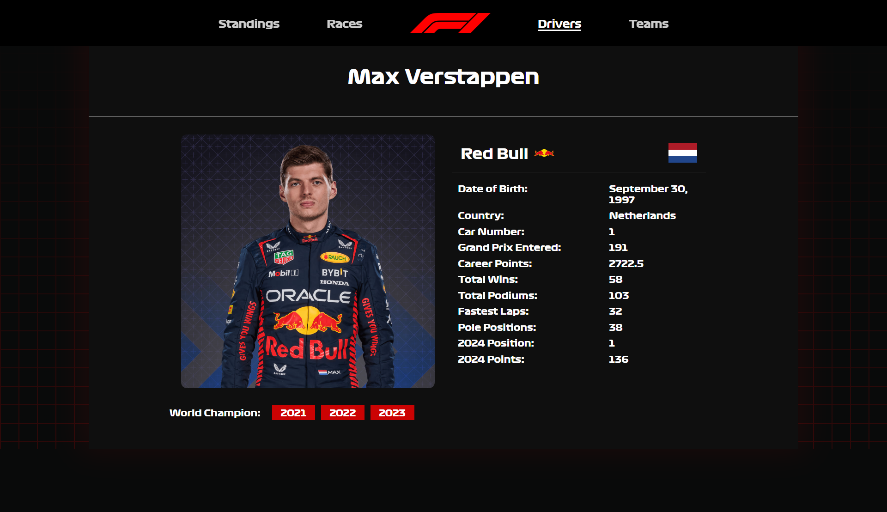
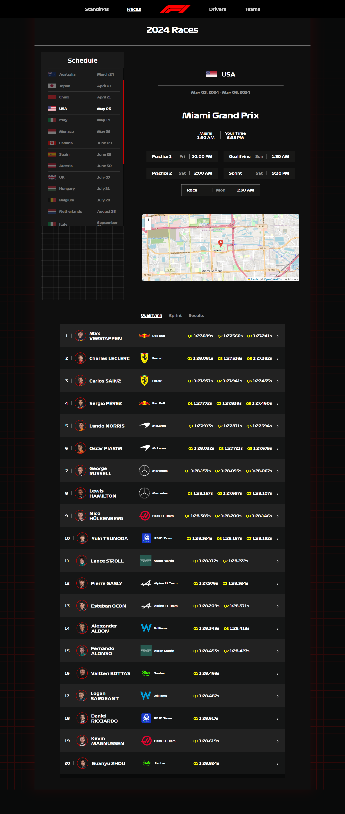
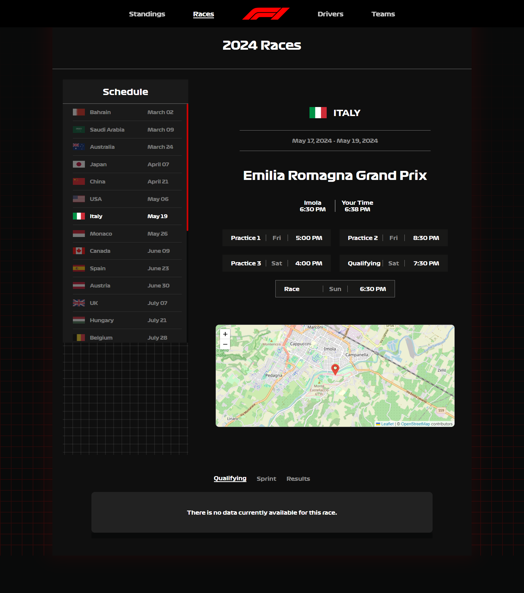
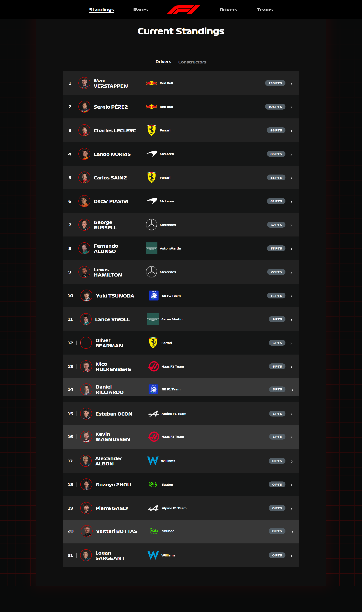
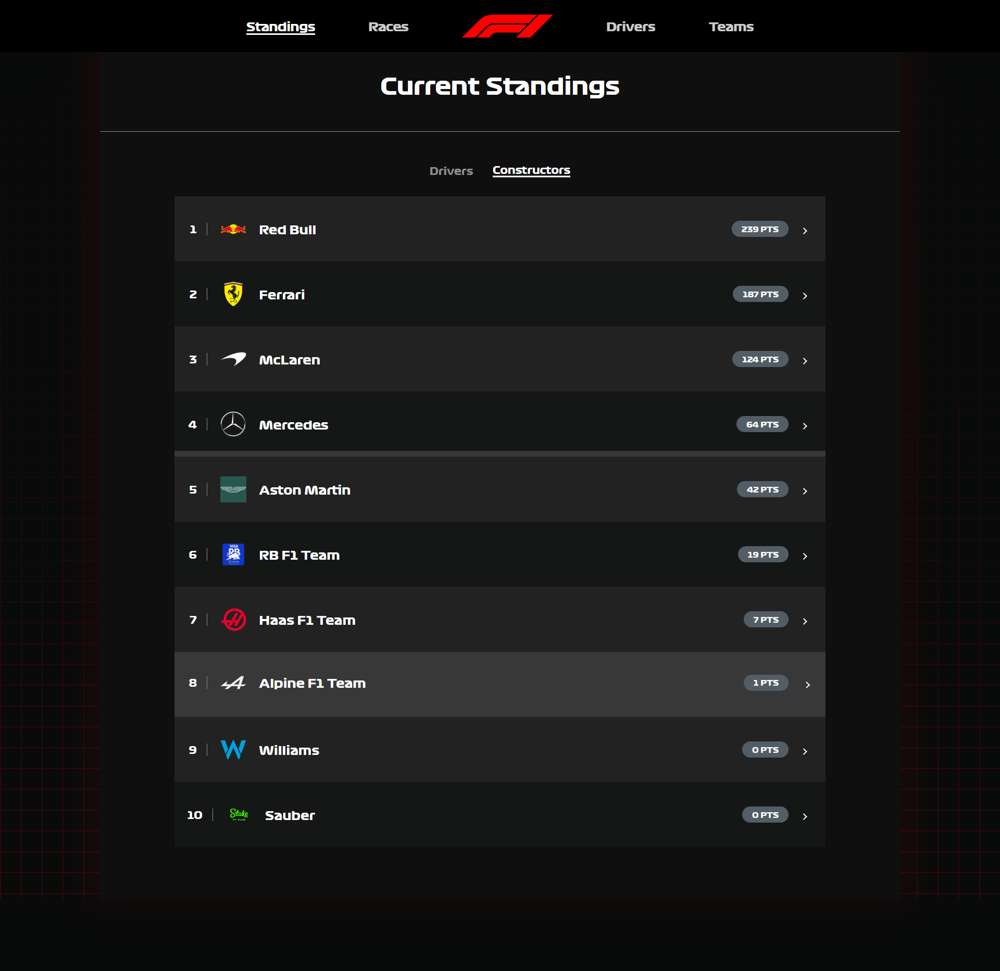

# F1 Fan Website

Welcome to the F1 Fan Website! This project is a dedicated platform for Formula 1 enthusiasts to explore detailed information about races, drivers, constructors, and standings. The website provides an intuitive interface to dive deep into the world of F1, with live updates, historical data, and more.

## Features

- **Drivers**: Explore detailed profiles of F1 drivers, including stats, achievements, and their journey in the world of F1.
- **Constructors**: Learn about the legendary F1 teams and their contributions to the sport.
- **Races**: Get schedules and results of F1 races, including detailed information about each event.
- **Standings**: Stay updated with the latest standings for drivers and constructors.
- **Dynamic Design**: Built with a responsive and modern interface for the best user experience.

## Screenshots

Here are some snapshots of the website:

### Homepage


### Constructors Page


### Scuderia Ferrari Profile


### Drivers Page


### Max Verstappen Profile


### Race Page - Event 6


### Race Page - Event 7


### Standings Overview


### Detailed Standings


## Technologies Used

- **Frontend**: React.js
- **Backend**: Node.js
- **Database**: MongoDB
- **Hosting**: Vercel

## How to Run Locally

1. Clone the repository:
   ```bash
   git clone https://github.com/Abhip32/f1.git
   ```
2. Navigate to the project directory:
   ```bash
   cd f1
   ```
3. Install dependencies:
   ```bash
   npm install
   ```
4. Start the development server:
   ```bash
   npm start
   ```
5. Open your browser and visit:
   ```
   http://localhost:3000
   ```

## Contributing

Contributions are welcome! If you'd like to contribute to the project, please follow these steps:

1. Fork the repository.
2. Create a new branch:
   ```bash
   git checkout -b feature-name
   ```
3. Make your changes and commit them:
   ```bash
   git commit -m "Add some feature"
   ```
4. Push to the branch:
   ```bash
   git push origin feature-name
   ```
5. Open a pull request.


---

### Thank you for exploring the F1 Fan Website! 🏎️
Feel free to raise an issue or contribute to enhance the project further.
```

Let me know if you'd like to add or tweak anything!
